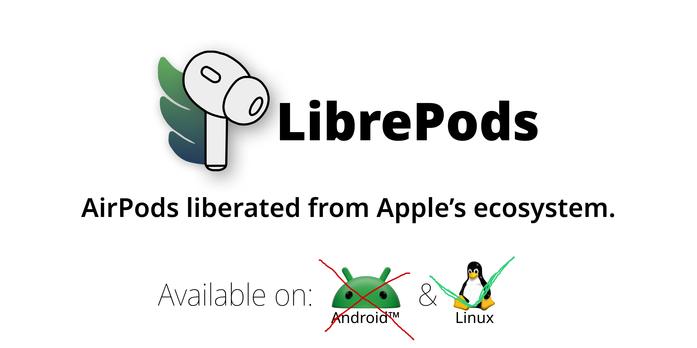

<picture>
  <source media="(prefers-color-scheme: dark)" srcset="./imgs/banner-dark.png" />
  <source media="(prefers-color-scheme: light)" srcset="./imgs/banner.png" />
  
</picture>

# librepods форк да

### почему это родилось

потому-что обычный librepods крутой но хочу под ся сделать + как-то заполнить акк на гитхабе

### чьими усилиями

мощностью моих мультиаккаутов сделаных через омнироут. вы не увидите ни одной строчки кода написаной человеком

### что изменено по сравнению с оригиналом?

вырезано все лишнее для моей конфигурации 

### Как установить?

не надо этого делать

## Установка

См. инструкцию для Linux в оригинальном проекте: [linux/README.md](/linux/README.md)

## Лицензия

LibrePods — AirPods liberated from Apple's ecosystem
Copyright (C) 2025 LibrePods contributors

Эта программа — свободное ПО: вы можете распространять и/или изменять её
на условиях GNU General Public License v3 (или более поздней версии),
опубликованной Free Software Foundation.

Программа распространяется в надежде на полезность, но БЕЗ КАКИХ-ЛИБО
ГАРАНТИЙ. Подробнее см. GNU General Public License.

Полный текст лицензии: <https://www.gnu.org/licenses/>

---

AirPods, AirPods Pro и логотип AirPods — товарные знаки Apple Inc. Проект не аффилирован с Apple Inc.
